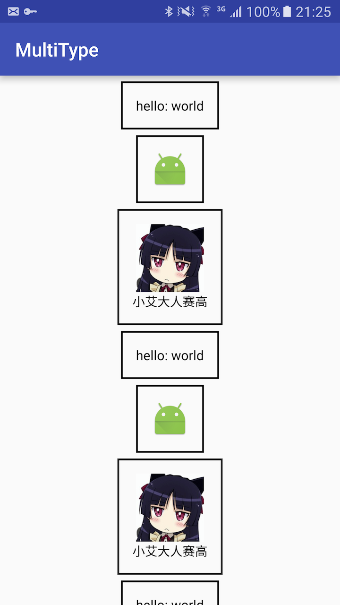
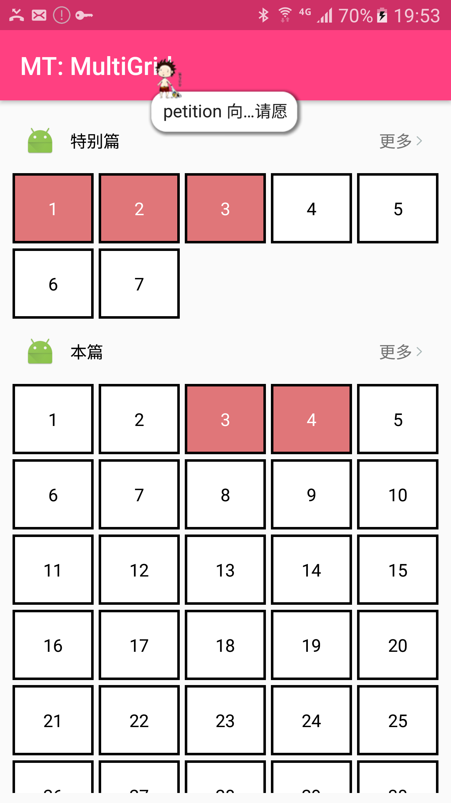

# MultiType
An Android library to retrofit multiple item view types

[](https://github.com/drakeet/MultiType/blob/master/LICENSE)


English Version | <a href="https://drakeet.me/multitype" target="_blank" rel="nofollow">中文版</a>

Previously, when we need to develop a complex RecyclerView/ListView, it is a boring and troublesome work. 
We should override the `getItemViewType` of `RecyclerView.Adapter` and add some types, 
then we create some `ViewHolder` to relate the type, all of the process it is a very bad experience.
**And once we need to add a new type, we have to go to the original Adapter and modify some old codes**, so sad. 

Today, I create a new graceful way to easily develop the complex RecyclerView/ListView, with my MultiType library, 
no matter how complex and how frequently changing list, we could insert a new type without changing the old codes.

[sample screenshots(示例程序截图)](https://github.com/drakeet/MultiType#sample-screenshots)

## Getting started

In your `build.gradle`:

```groovy
dependencies {
    compile 'me.drakeet.multitype:multitype:2.1.0'
}
```

## Usage

#### Step 1. Create a class __implements__ `Item`, It would be your `data model`/`Java bean`, for example:

```java
public class TextItem implements Item {

    @NonNull public String text;

    public TextItem(@NonNull final String text) {
        this.text = text;
    }
}
```

#### Step 2. Create a class extends `ItemViewProvider<C extends Item, V extends ViewHolder>`, for example:

```java
public class TextItemViewProvider
    extends ItemViewProvider<TextItem, TextItemViewProvider.TextHolder> {

    static class TextHolder extends RecyclerView.ViewHolder {
        @NonNull private final TextView text;


        TextHolder(@NonNull View itemView) {
            super(itemView);
            this.text = (TextView) itemView.findViewById(R.id.text);
        }
    }


    @NonNull @Override
    protected TextHolder onCreateViewHolder(
        @NonNull LayoutInflater inflater, @NonNull ViewGroup parent) {
        View root = inflater.inflate(R.layout.item_text, parent, false);
        return new TextHolder(root);
    }


    @Override
    protected void onBindViewHolder(@NonNull TextHolder holder, @NonNull TextItem textItem) {
        holder.text.setText("hello: " + textItem.text);
    }
}
```

#### Step 3. You do not need to create another new class. Just `register` in your `Application` and add a `RecyclerView` and `List<TypeItem>` to your `Activity`, for example:

```java
public class App extends Application {

    @Override public void onCreate() {
        super.onCreate();
        MultiTypePool.register(TextItem.class, new TextItemViewProvider());
        MultiTypePool.register(ImageItem.class, new ImageItemViewProvider());
        MultiTypePool.register(RichItem.class, new RichItemViewProvider());
        MultiTypePool.register(Category.class, new CategoryItemViewProvider());
        MultiTypePool.register(PostRowItem.class, new PostRowItemViewProvider());
        MultiTypePool.register(PostList.class, new HorizontalItemViewProvider());
    }
}
```

```java
public class MainActivity extends AppCompatActivity {

    @Override protected void onCreate(Bundle savedInstanceState) {
        super.onCreate(savedInstanceState);
        setContentView(R.layout.activity_main);
        RecyclerView recyclerView = (RecyclerView) findViewById(R.id.list);

        /* Or you could use List<Item> */
        Items items = new Items();
        TextItem textItem = new TextItem("world");
        ImageItem imageItem = new ImageItem(R.mipmap.ic_launcher);
        RichItem richItem = new RichItem("小艾大人赛高", R.mipmap.avatar);

        for (int i = 0; i < 20; i++) {
            items.add(textItem);
            items.add(imageItem);
            items.add(richItem);
        }

        recyclerView.setAdapter(new MultiTypeAdapter(items));
    }
}
```

**You're good to go!**

## Sample screenshots

You could check the `sample` module for more details and after running it will look like: 

  

And it has been used in [drakeet/TimeMachine](http://github.com/drakeet/TimeMachine), you could check the `Message extends TypeItem` to learn **how to custom TypeItem** and it is recommended to read the `MessageViewProvider`, they are all great guide: 

[](http://github.com/drakeet/TimeMachine)


## Performance testing

I found a Xiaomi 2s (Android 5.1.1, made in 2012) mobile phone for **testing the performance of global static MultiTypePool(#15)** today. I registered 9999 `ItemContent` classes & `ItemViewProvider` instances in the Application beginning. The `ItemContent` contains 12 random `String`s and the `ItemViewProvider.TestViewHolder` contains 12 `TextView`s, and I put my target type after 10000 index for test Adapter onCreateViewHolder's performance.

The results of this testing showed that:


**The initialization of registering 10000 types just spend 10ms! And the memory usage is also very low** because `ItemViewProvider` instances do not hold any other class instance actually. And the `RecyclerView` which contains MultiType also perform perfectly and smoothly.

So, is there a application reach 10000 types? Do we really need a local type pool? The answer is obvious.


## Change logs & Releases

https://github.com/drakeet/MultiType/releases


## Q&A (English Version later)

**Q: 为什么使用静态或者全局类型池？(Why we need static and single TypePool?)**

A: 我不反对局部或临时类型池的设计，你可以 fork 这个项目自行实现，它们对于内存更加友好（但也只是微小优势而已），但在我看来，全局类型池在多方面更好：
- 它能够**显式**连接 Type 和它的 Item View，能够在同一地方统一 register，这将避免分散，带来很好的直观性和可管理性；
- 一个应用不会有超级大量的类型定义，类型 class 和 provider 对象都是非常轻薄的对象，直接静态存于内存，并不会导致内存泄漏和大的内存占用问题，几乎可以忽略；
- 至于要不要支持 optional 的局部类型池参数，我也是不喜欢支持的，前面说了，这是没必要的，而且若是可选（optional）也会使用户疑惑：“到底要还是不要？”

因此我喜欢和坚持使用全局静态类型池，它不会带来什么问题，而且好处诸多，有人给我提交了使用反射的方法来自动获取类型连接，为了避免性能话题，我不喜欢反射，而且将类型连接变得复杂和不可见性未必是好事。我一直坚持的原则是：写简单的代码，写可读的代码，实现复杂的需求（你们看我的代码是不是感觉很自然而然而且可读性十分好？）

License
-------

    Copyright 2016 drakeet.

    Licensed under the Apache License, Version 2.0 (the "License");
    you may not use this file except in compliance with the License.
    You may obtain a copy of the License at

       http://www.apache.org/licenses/LICENSE-2.0

    Unless required by applicable law or agreed to in writing, software
    distributed under the License is distributed on an "AS IS" BASIS,
    WITHOUT WARRANTIES OR CONDITIONS OF ANY KIND, either express or implied.
    See the License for the specific language governing permissions and
    limitations under the License.


