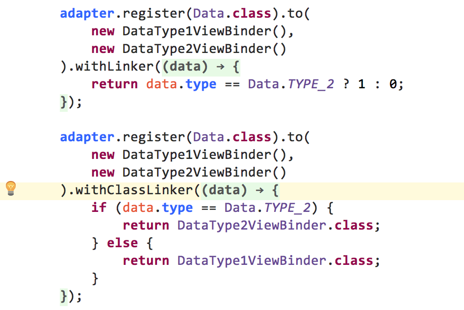

# MultiType
An Android library to create multiple item types list views easily and flexibly.

[](https://travis-ci.org/drakeet/MultiType)
[](https://github.com/drakeet/MultiType/blob/master/LICENSE)


English Version | [《Android 复杂的列表视图新写法 · 详解篇》](https://github.com/drakeet/Effective-MultiType/blob/master/README.md)

Previously, when we need to develop a complex RecyclerView/ListView, it is a difficult and 
troublesome work. We should override the `getItemViewType` of `RecyclerView.Adapter` , add some 
types, and create some `ViewHolder`s relating to the types. The process is cumbersome.

**Once we need to add a new item type, we have to go to the original adapter and modify some old codes,** 
and adapter classes will be more bulky.

Today, I create a new intuitive and flexible way to easily create the complex RecyclerView/ListView, 
with the MultiType library, we could insert a new item type without changing the old adapter codes 
and make them more readable.

## Getting started

In your `build.gradle`:

```groovy
dependencies {
    compile 'me.drakeet.multitype:multitype:3.1.0'
}
```

If you are using `com.android.tools.build:gradle:3.+`, use this instead:

```groovy
dependencies {
    implementation 'me.drakeet.multitype:multitype:3.1.0'
}
```

## Usage

#### Step 1. Create a class, It would be your `data model`/`Java bean`, for example:

```java
public class TextItem {

    public @NonNull final String text;

    public TextItem(@NonNull String text) {
        this.text = text;
    }
}
```

#### Step 2. Create a class extends `ItemViewBinder<T, VH extends ViewHolder>`, for example:

```java
public class TextItemViewBinder extends ItemViewBinder<TextItem, TextItemViewBinder.TextHolder> {

    static class TextHolder extends RecyclerView.ViewHolder {
    
        private @NonNull final TextView text;

        TextHolder(@NonNull View itemView) {
            super(itemView);
            this.text = (TextView) itemView.findViewById(R.id.text);
        }
    }

    @NonNull @Override
    protected TextHolder onCreateViewHolder(@NonNull LayoutInflater inflater, @NonNull ViewGroup parent) {
        View root = inflater.inflate(R.layout.item_text, parent, false);
        return new TextHolder(root);
    }

    @Override
    protected void onBindViewHolder(@NonNull TextHolder holder, @NonNull TextItem textItem) {
        holder.text.setText("hello: " + textItem.text);
        Log.d("demo", "position: " + getPosition(holder));
        Log.d("demo", "adapter: " + getAdapter());
    }
}
```

#### Step 3. Just `register` your types and setup your `RecyclerView` and `List<Object>` in your `Activity`, for example:

```java
public class SampleActivity extends AppCompatActivity {

    private MultiTypeAdapter adapter;
    private Items items;

    @Override 
    protected void onCreate(Bundle savedInstanceState) {
        super.onCreate(savedInstanceState);
        setContentView(R.layout.activity_main);
        RecyclerView recyclerView = (RecyclerView) findViewById(R.id.list);

        adapter = new MultiTypeAdapter();
        adapter.register(TextItem.class, new TextItemViewBinder());
        adapter.register(ImageItem.class, new ImageItemViewBinder());
        adapter.register(RichItem.class, new RichItemViewBinder());
        recyclerView.setAdapter(adapter);

        /* Mock the data */
        TextItem textItem = new TextItem("world");
        ImageItem imageItem = new ImageItem(R.mipmap.ic_launcher);
        RichItem richItem = new RichItem("小艾大人赛高", R.mipmap.avatar);

        items = new Items();
        for (int i = 0; i < 20; i++) {
            items.add(textItem);
            items.add(imageItem);
            items.add(richItem);
        }
        adapter.setItems(items);
        adapter.notifyDataSetChanged();
    }
}
```

**That's all, you're good to go!**


## Advanced usage 

**One to Multiple**:  



## Wiki

<a href="https://github.com/drakeet/MultiType/wiki/Android-MultiType-3.0"></a>

## Change Log

https://github.com/drakeet/MultiType/releases

## Android Studio Plugin

- **[drakeet/MultiTypeTemplates](https://github.com/drakeet/MultiTypeTemplates)**

 An intellij idea plugin for Android to generate `MultiType` `Item` and `ItemViewBinder` easily.


## Sample screenshots

You could check the `sample` module for more details and after running it will look like:

  

 


And it has been used in [drakeet/TimeMachine](http://github.com/drakeet/TimeMachine):

[](http://github.com/drakeet/TimeMachine)

License
-------

    Copyright 2017 drakeet.

    Licensed under the Apache License, Version 2.0 (the "License");
    you may not use this file except in compliance with the License.
    You may obtain a copy of the License at

       http://www.apache.org/licenses/LICENSE-2.0

    Unless required by applicable law or agreed to in writing, software
    distributed under the License is distributed on an "AS IS" BASIS,
    WITHOUT WARRANTIES OR CONDITIONS OF ANY KIND, either express or implied.
    See the License for the specific language governing permissions and
    limitations under the License.
