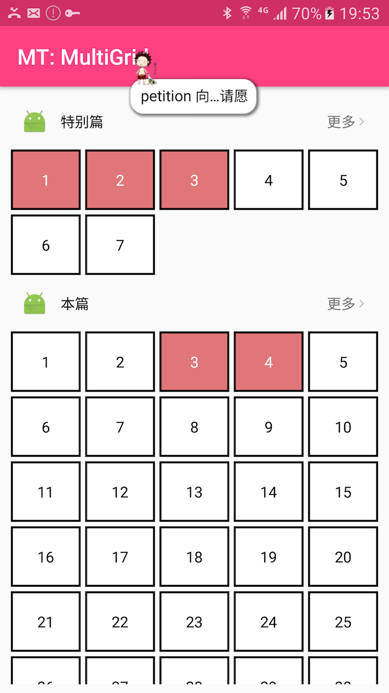

# MultiType
An Android library to retrofit multiple item view types

[](https://github.com/drakeet/MultiType/blob/master/LICENSE)


English Version | [《Android 复杂的列表视图新写法 · 详解篇》](https://github.com/drakeet/Effective-MultiType/blob/master/README.md)

Previously, when we need to develop a complex RecyclerView/ListView, it is a boring and troublesome work.
We should override the `getItemViewType` of `RecyclerView.Adapter` and add some types,
then we create some `ViewHolder` to relate the type, all of the process it is a very bad experience.
**And once we need to add a new type, we have to go to the original Adapter and modify some old codes**, so sad.

Today, I create a new graceful way to easily develop the complex RecyclerView/ListView, with my MultiType library,
no matter how complex and how frequently changing list, we could insert a new type without changing the old codes.

[sample screenshots(示例程序截图)](https://github.com/drakeet/MultiType#sample-screenshots)

## Getting started

In your `build.gradle`:

```groovy
dependencies {
    compile 'me.drakeet.multitype:multitype:2.4.2'
}
```

**NOTE**: If you are updating from **v2.4.0** to v2.4.2,
note that the `setItems(items)` method has removed the `notifyDataSetChanged()`
and you need to call it by yourself.

## Usage

#### Step 1. Create a class, It would be your `data model`/`Java bean`, for example:

```java
public class TextItem {

    @NonNull public String text;

    public TextItem(@NonNull final String text) {
        this.text = text;
    }
}
```

#### Step 2. Create a class extends `ItemViewProvider<T, V extends ViewHolder>`, for example:

```java
public class TextItemViewProvider
    extends ItemViewProvider<TextItem, TextItemViewProvider.TextHolder> {

    static class TextHolder extends RecyclerView.ViewHolder {
        @NonNull private final TextView text;

        TextHolder(@NonNull View itemView) {
            super(itemView);
            this.text = (TextView) itemView.findViewById(R.id.text);
        }
    }

    @NonNull @Override
    protected TextHolder onCreateViewHolder(
        @NonNull LayoutInflater inflater, @NonNull ViewGroup parent) {
        View root = inflater.inflate(R.layout.item_text, parent, false);
        return new TextHolder(root);
    }

    @Override
    protected void onBindViewHolder(@NonNull TextHolder holder, @NonNull TextItem textItem) {
        holder.text.setText("hello: " + textItem.text);
        Log.d("demo", "position: " + getPosition(holder));
        Log.d("demo", "adapter: " + getAdapter().toString());
    }
}
```

#### Step 3. You do not need to create another new class. Just `register` your types and add a `RecyclerView` and `List<Object>` to your `Activity`, for example:

```java
public class NormalActivity extends AppCompatActivity {

    private MultiTypeAdapter adapter;

    @Override protected void onCreate(Bundle savedInstanceState) {
        super.onCreate(savedInstanceState);
        setContentView(R.layout.activity_main);
        RecyclerView recyclerView = (RecyclerView) findViewById(R.id.list);

        adapter = new MultiTypeAdapter();
        adapter.register(TextItem.class, new TextItemViewProvider());
        adapter.register(ImageItem.class, new ImageItemViewProvider());
        adapter.register(RichItem.class, new RichItemViewProvider());
        recyclerView.setAdapter(adapter);

        TextItem textItem = new TextItem("world");
        ImageItem imageItem = new ImageItem(R.mipmap.ic_launcher);
        RichItem richItem = new RichItem("小艾大人赛高", R.mipmap.avatar);

        Items items = new Items();
        for (int i = 0; i < 20; i++) {
            items.add(textItem);
            items.add(imageItem);
            items.add(richItem);
        }
        adapter.setItems(items);
        adapter.notifyDataSetChanged();
    }
}
```

**You're good to go!**

## Change Log

https://github.com/drakeet/MultiType/releases

## Wiki

[](https://github.com/drakeet/Effective-MultiType/blob/master/README.md)

## Android Studio Plugin

- **[drakeet/MultiTypeTemplates](https://github.com/drakeet/MultiTypeTemplates)**

 An intellij idea plugin for Android to generate `MultiType` `Item` and `ItemViewProvider` easily.


## Sample screenshots

You could check the `sample` module for more details and after running it will look like:

  
 


And it has been used in [drakeet/TimeMachine](http://github.com/drakeet/TimeMachine):

[](http://github.com/drakeet/TimeMachine)

## Change logs & Releases

https://github.com/drakeet/MultiType/releases

License
-------

    Copyright 2016 drakeet.

    Licensed under the Apache License, Version 2.0 (the "License");
    you may not use this file except in compliance with the License.
    You may obtain a copy of the License at

       http://www.apache.org/licenses/LICENSE-2.0

    Unless required by applicable law or agreed to in writing, software
    distributed under the License is distributed on an "AS IS" BASIS,
    WITHOUT WARRANTIES OR CONDITIONS OF ANY KIND, either express or implied.
    See the License for the specific language governing permissions and
    limitations under the License.
